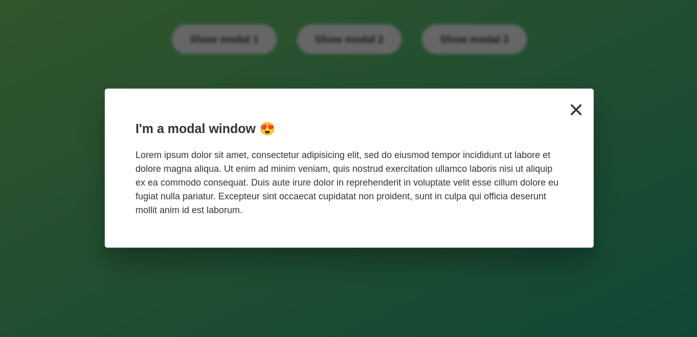

# Modal Window

A modal section is a dialog box/popup window that is displayed something.

It precludes the user from working on other parts of the user interface. To resume work on the user interface, we must close the modal section.

A modal section is not an alert.

