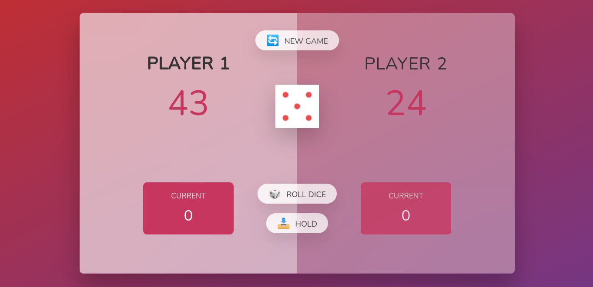
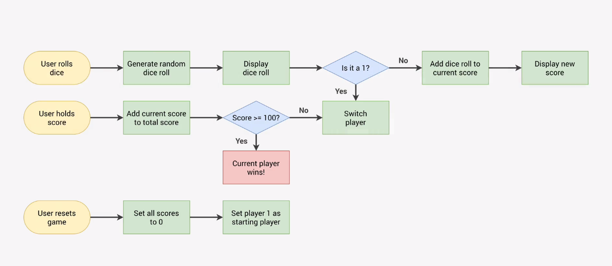

# Pig Game

**Pig** is a simple `dice game` first described in print in John Scarne in 1945. Players take turns to roll a single dice as many times as they wish, adding all roll results to a running total, but losing their gained score for the turn if they roll a 1.

**Gameplay**

Each turn, a player repeatedly rolls dice until either a 1 is rolled or the player decides to "hold":

- If the player rolls a 1, they score nothing and it becomes the next player's turn
- If the player rolls any other number, it is added to their turn total and the player's turn continues
- If the player chooses to "hold", their turn total is added to their score, and it becomes the next player's turn

The first player to score 100 or more points winds.

**Flowchart**

- Whenever the user rolls to dice (clicks roll dice button):
  -Generate a random dice roll.
  - Display at dice roll area
  - Check dice roll:
    - if it is NOT one, add the dice roll to the current score
    - if it is one, switch the player and the dice roll will NOT get added to the current score
- The user wants to hold the score:
  - Add the current score to the total score
  - Check the total score:
    - if the total score is above or equal to 100, the current player wins
    - if the total score is below 100, switch the player and the game keeps on running
- The user chooses to reset the game:
  - Set all scores to zero
  - Set the player 1 back to being the starting player

